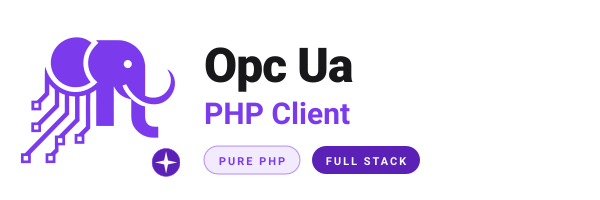

<h1 align="center"><strong>OPC UA — AI Skills</strong></h1>

<div align="center">
  <picture>
    <source media="(prefers-color-scheme: dark)" srcset="assets/logo-dark.svg">
    <source media="(prefers-color-scheme: light)" srcset="assets/logo-light.svg">
    
  </picture>
</div>

<p align="center">
  
  
  
  <a href="https://github.com/php-opcua"></a>
</p>

<p align="center">
  <a href="https://github.com/php-opcua">php-opcua org</a> ·
  <a href="https://www.php-opcua.com">php-opcua.com</a> ·
  <a href="https://www.php-opcua.com/dev/components">Documentation</a>
</p>

---

**Read-only aggregation of the AI skills published by every [`php-opcua`](https://github.com/php-opcua) package.** Each package ships a self-contained [Agent Skill](https://docs.claude.com/en/docs/agents-and-tools/agent-skills) under its own `.ai/skills/<package>/`; a sync job mirrors each one into [`skills/<package>/`](skills/) here, so an AI coding assistant can pull the whole ecosystem's knowledge from a single repository.

Give these to your agent and it knows how to use the php-opcua libraries correctly — the right APIs, the idiomatic patterns, the security model, the testing approach, and the common pitfalls — without guessing.

> [!NOTE]
> **This repository is generated. Do not edit `skills/` here.** Each skill is owned by its source package (`.ai/skills/<package>/`) and overwritten on the next sync. Open changes against the source repository linked in the table below.

## Skills

| Skill | What it covers | Source |
| --- | --- | --- |
| [`opcua-client`](skills/opcua-client) | The core pure-PHP OPC UA client — read, write, browse, call methods, subscribe, history, trust, custom modules. | [opcua-client](https://github.com/php-opcua/opcua-client) |
| [`opcua-cli`](skills/opcua-cli) | Terminal OPC UA — single-shot commands (browse, read, write, watch, explore, trust, …) with `--json` output. | [opcua-cli](https://github.com/php-opcua/opcua-cli) |
| [`opcua-client-nodeset`](skills/opcua-client-nodeset) | Pre-generated PHP types for OPC Foundation companion specifications (Robotics, MachineTool, DI, Machinery, BACnet, MTConnect, …). | [opcua-client-nodeset](https://github.com/php-opcua/opcua-client-nodeset) |
| [`opcua-session-manager`](skills/opcua-session-manager) | Keep OPC UA sessions alive across PHP requests via a ReactPHP daemon and local IPC. | [opcua-session-manager](https://github.com/php-opcua/opcua-session-manager) |
| [`opcua-client-ext-reverse-connect`](skills/opcua-client-ext-reverse-connect) | Accept OPC UA Reverse Connect (ReverseHello) handshakes — the server dials the client (Part 6 §7.1.2.3). | [opcua-client-ext-reverse-connect](https://github.com/php-opcua/opcua-client-ext-reverse-connect) |
| [`opcua-client-ext-transport-https`](skills/opcua-client-ext-transport-https) | `opc.https://` transport (Part 6 §7.4) — one POST per UA message, TLS as the secure channel. | [opcua-client-ext-transport-https](https://github.com/php-opcua/opcua-client-ext-transport-https) |
| [`laravel-opcua`](skills/laravel-opcua) | Laravel 11/12/13 integration — `Opcua` facade, `.env`-based named connections, Artisan commands. | [laravel-opcua](https://github.com/php-opcua/laravel-opcua) |
| [`symfony-opcua`](skills/symfony-opcua) | Symfony 7.3+/8.x bundle — autowired `OpcuaManager` / `OpcUaClientInterface`, YAML named connections. | [symfony-opcua](https://github.com/php-opcua/symfony-opcua) |

## Layout

Each skill follows the [Anthropic Agent Skills](https://docs.claude.com/en/docs/agents-and-tools/agent-skills) format:

```
skills/<package>/
├── SKILL.md          # frontmatter (name, description, compatibility) + the mental model & API surface
├── references/       # deep-dive docs loaded on demand (architecture, testing, pitfalls, …)
└── assets/           # worked examples / recipes
```

The `SKILL.md` frontmatter `description` is written so an agent can decide *when* the skill is relevant; the body and `references/` tell it *how* to use the package correctly.

## Installation

The skills are plain folders — install the ones you need wherever your AI tool looks for skills, rules, or guidelines. Grab the repo once:

```bash
git clone https://github.com/php-opcua/ai-skills.git
```

> Take only the skills for the packages you actually use — each folder is self-contained.

### Claude Code / Claude agents — native, recommended

These *are* [Anthropic Agent Skills](https://docs.claude.com/en/docs/agents-and-tools/agent-skills), so Claude Code loads them with zero conversion.

```bash
# personal — available in every project
mkdir -p ~/.claude/skills
cp -r ai-skills/skills/opcua-client ~/.claude/skills/

# or per-project — committed alongside your code
mkdir -p .claude/skills
cp -r ai-skills/skills/laravel-opcua .claude/skills/
```

Claude Code auto-discovers each `SKILL.md` and activates it when the task matches its `description` — no manual mention needed. It pulls in `references/` on demand.

### Laravel Boost

[Laravel Boost](https://github.com/laravel/boost) (v2+) wires an MCP server and your editor's AI integration (Claude Code, Cursor, Copilot, PhpStorm, …) into a Laravel app, and can pull skills straight from a GitHub repo — no manual copying:

```bash
composer require laravel/boost --dev
php artisan boost:install

# list the skills this repo offers
php artisan boost:add-skill php-opcua/ai-skills --list

# add a specific one (Boost syncs it across all your configured agents)
php artisan boost:add-skill php-opcua/ai-skills --skill opcua-client

# …or grab them all
php artisan boost:add-skill php-opcua/ai-skills --all
```

`boost:add-skill` accepts `--skill <name>` (repeatable), `--all`, `--force` (overwrite), and `--skip-audit`. If Boost doesn't auto-locate the skills, point it at the subdirectory: `php artisan boost:add-skill php-opcua/ai-skills/skills`.

Boost also ships version-aware Laravel / Livewire / Pest guidelines; these OPC UA skills layer on top. Start with **`laravel-opcua`** (the Laravel integration) plus **`opcua-client`** for the underlying API.

### Cursor

Cursor reads project rules from `.cursor/rules/`:

```bash
mkdir -p .cursor/rules
cp ai-skills/skills/opcua-client/SKILL.md .cursor/rules/opcua-client.mdc
```

Add any `references/*.md` the task touches the same way.

### Windsurf

```bash
mkdir -p .windsurf/rules
cp ai-skills/skills/opcua-client/SKILL.md .windsurf/rules/opcua-client.md
```

### GitHub Copilot

Fold the skill into your repo-wide instructions:

```bash
mkdir -p .github
cat ai-skills/skills/opcua-client/SKILL.md >> .github/copilot-instructions.md
```

### Any other assistant (ChatGPT, Gemini, Continue, …)

Paste or attach the relevant `SKILL.md` — plus the `references/*.md` pages the task needs — as context. The frontmatter `description` tells the model *when* the skill applies; the body tells it *how*.

## Contributing

Don't send PRs here — the `skills/` tree is overwritten on every sync. To improve a skill, edit it in its **source package** under `.ai/skills/<package>/` and the change propagates on the next sync.

---

<p align="center">
  Part of the <a href="https://github.com/php-opcua">php-opcua</a> ecosystem · Built by <a href="https://www.php-opcua.com">php-opcua.com</a>
</p>
